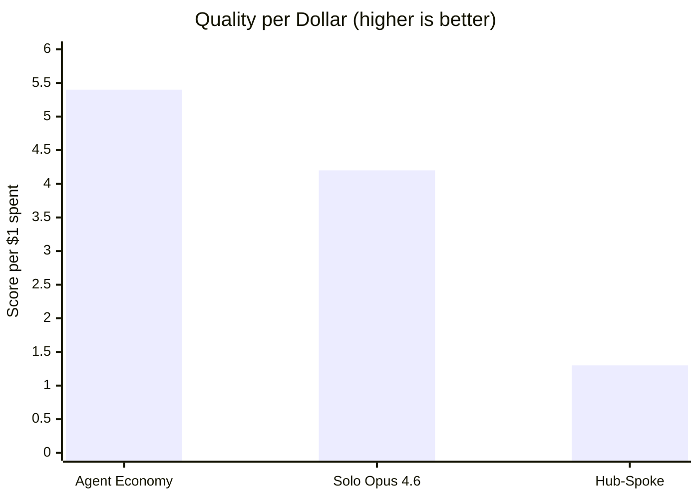
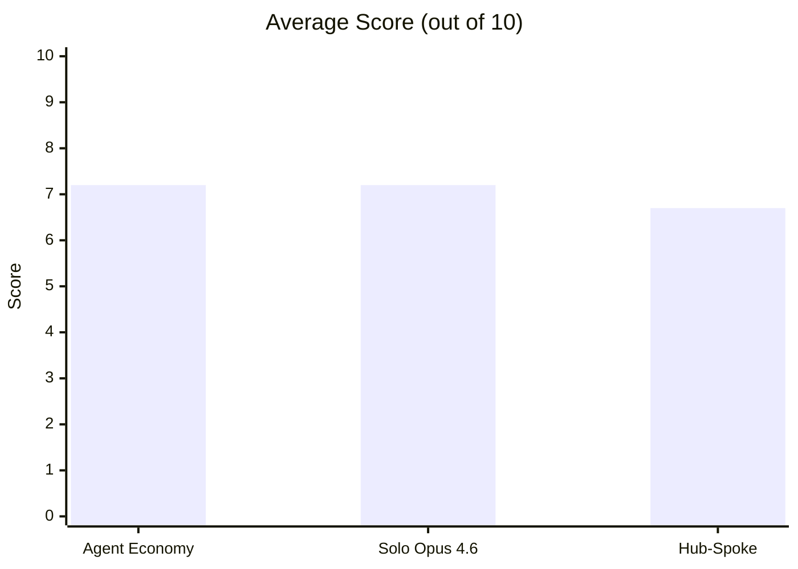
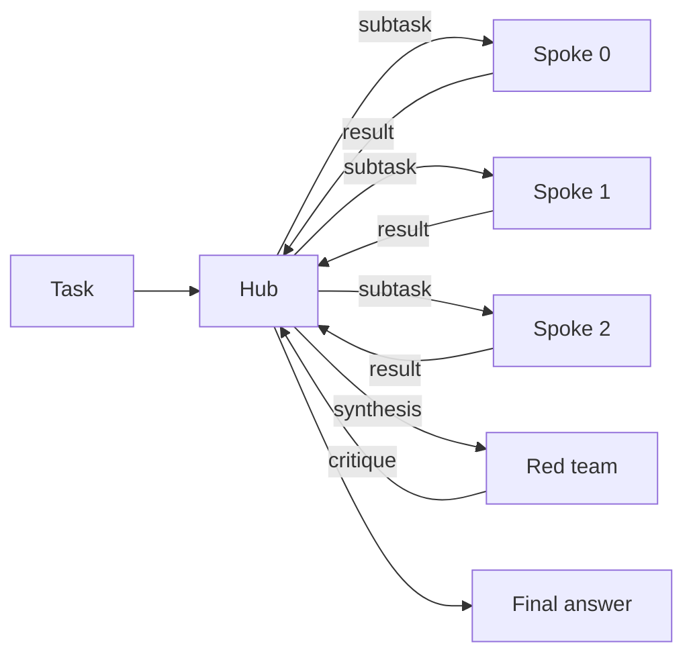
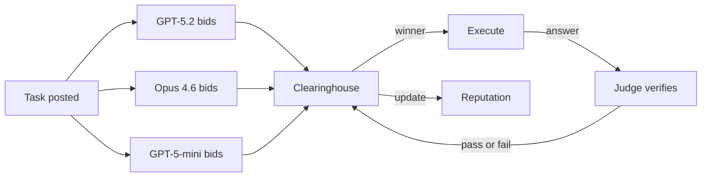

# Hub vs Spoke vs Market

Where should a task go when we can call several LLMs? We can give it to one strong model. We can hand it to a hub that splits it into subtasks. We can post it to a market and let models bid. This repo runs all three on the same 15 tasks and counts score, passes, tokens, cost, and time.

The result lands fast. The market matches the solo baseline on quality, cuts cost by 21 percent, and beats hub-spoke by a wide margin on cost. Solo still wins coding. The market wins reasoning. Hub-spoke pays a large coordination bill and rarely earns it back.

## Results

The tables below use the full run in `results/hard_run.jsonl` and `results/hard_summary.csv`.

### Full Run (15 Tasks, 3 Reps, 135 Scored Runs)





| Condition | Avg Score | Pass Rate | Total Cost | Score/$ |
| --- | ---: | ---: | ---: | ---: |
| Agent Economy | 7.2 | 76% (34/45) | $1.34 | 5.4 |
| Solo (Opus 4.6) | 7.2 | 73% (33/45) | $1.69 | 4.2 |
| Hub-Spoke | 6.7 | 67% (30/45) | $5.33 | 1.3 |

Across 45 full-run task results per topology, the market averages 7.2 out of 10 at $1.34. Solo averages 7.2 at $1.69. Hub-spoke drops to 6.7 at $5.33. Bootstrap 95% confidence intervals overlap: market [6.1, 8.2], solo [6.3, 8.0], hub-spoke [5.8, 7.5]. The clean top-line claim stays narrow: the market matches solo here. It does not beat it overall.

## The Split That Matters

| Task type | Agent Economy | Solo (Opus 4.6) | Hub-Spoke |
| --- | ---: | ---: | ---: |
| Coding | 6.7 | 8.4 | 7.9 |
| Reasoning | 7.1 | 5.1 | 5.2 |
| Synthesis | 7.7 | 8.1 | 6.9 |

Coding favors the solo expert. Solo posts 8.4. Hub-spoke reaches 7.9. The market trails at 6.7.

Reasoning favors the market. The market posts 7.1. Solo and hub-spoke both hover near 5. One task drives much of that gap: the exact-match probability problem. The market solves it in all three reps. Solo and hub-spoke miss it every time.

Synthesis stays close. Solo edges the market 8.1 to 7.7. Hub-spoke trails again at 6.9.

<details>
<summary>Full-run per-task scores (averaged over 3 reps)</summary>

| Task | Agent Economy | Hub-Spoke | Solo | Best |
| --- | ---: | ---: | ---: | --- |
| coding-001 (interval store) | 6.3 | 8.3 | 9.7 | solo |
| coding-002 (debug sliding window) | 10.0 | 9.7 | 9.3 | tie |
| coding-003 (refactor monolith) | 1.3 | 6.0 | 5.3 | hub-spoke |
| coding-004 (LRU cache) | 9.7 | 9.0 | 10.0 | tie |
| coding-005 (async concurrency bugs) | 6.0 | 6.7 | 7.7 | solo |
| reasoning-001 (combinatorial probability) | 10.0 | 0.0 | 0.0 | market |
| reasoning-002 (constraint scheduling) | 6.7 | 9.7 | 9.0 | hub-spoke |
| reasoning-003 (causal chain analysis) | 9.0 | 9.0 | 9.3 | tie |
| reasoning-004 (logic grid puzzle) | 3.0 | 4.0 | 3.3 | hub-spoke |
| reasoning-005 (constrained magic square) | 7.0 | 3.3 | 3.7 | market |
| synthesis-001 (distributed consistency) | 9.0 | 8.3 | 7.7 | market |
| synthesis-002 (monorepo debate) | 9.0 | 7.3 | 8.3 | market |
| synthesis-003 (multi-audience Raft) | 8.7 | 4.3 | 8.3 | tie |
| synthesis-004 (EHR architecture) | 6.0 | 6.0 | 7.0 | solo |
| synthesis-005 (microservices critique) | 6.0 | 8.3 | 9.0 | solo |

Task wins: Agent Economy 4, Solo 4, Hub-Spoke 3, with 4 ties.

`reasoning-001` asks for an exact-match probability answer. The only perfect answer is `10/33`. Only the market gets that answer in all three reps. `reasoning-004` stays hard for everyone; nobody averages above 4.

</details>

<details>
<summary>Hard vs medium tasks</summary>

| Difficulty | Agent Economy | Solo (Opus 4.6) | Hub-Spoke |
| --- | ---: | ---: | ---: |
| Medium (5 tasks) | 6.9 | 6.7 | 6.7 |
| Hard (10 tasks) | 7.3 | 7.4 | 6.6 |

Hard tasks do not break the market or solo. Both stay steady. Hub-spoke drops.

</details>

<details>
<summary>Market internals: routing and reputation</summary>

Three workers enter the market: GPT-5.2, Opus 4.6, and GPT-5-mini.

Who takes tasks? Across 45 full-run market tasks, GPT-5.2 takes 28, Opus 4.6 takes 11, six runs end with no fill, and GPT-5-mini takes none.

Reputation at session end: GPT-5.2 = 1.14, Opus 4.6 = 1.18, GPT-5-mini = 1.00.

Routing accuracy: on 15 shadow checks, the market matches the oracle winner 12 times. One miss comes from a wrong-model pick on the hard logic puzzle. Two misses come from no-fill runs even though a strong shadow answer exists.

</details>

<details>
<summary>Shadow counterfactual analysis</summary>

On 5 shadow tasks per rep, all three market workers answer the same question. That lets us compare the market winner with the best answer available in the pool.

Most checks show no regret. The clean routing miss lands on `reasoning-004` rep 0: the market picks Opus 4.6 and scores 3, while GPT-5.2 would have scored 9. The other misses land on `coding-005` rep 1 and `synthesis-005` rep 0, where the market fails to fill the task even though the shadow pool contains a 9-point answer.

Parallel-3-pick baseline: on 12 of 15 shadow runs, the market matches the result we would get by running all three answers and then taking the best one.

</details>

## What the Market Learns

The market does not discover a bustling republic of specialists. It learns a much simpler rule.

GPT-5.2 handles most tasks. Opus 4.6 handles the harder residue. GPT-5-mini wins none. Six runs never fill. That pattern points to a gate, not an ecosystem. The market filters out the weak worker, leans on the cheaper strong worker, falls back to Opus, and sometimes drops the task.

The shadow checks tell the same story. On 15 routing checks, the market picks the oracle winner 12 times. Useful, yes. Precise, no.

## Why Hub-Spoke Pays Too Much

Hub-spoke takes the longest path through the code. The hub decomposes the task, hands subtasks to three workers, reads their answers, writes a synthesis, asks for a critique, and revises. That path spends tokens at every step and opens more room for drift, padding, and contradiction.

Hub-spoke still steals a few tasks. It wins `coding-003`, `reasoning-002`, and `reasoning-004` in the full run. Those wins never pay the bill.

## How the Repo Runs the Test

Start at `scripts/run_benchmark.py`. The runner loads 15 tasks from `src/hub_vs_spoke/tasks/`, builds three configs, and loops over reps. Solo and hub-spoke run one task at a time. The market runs the full 15-task session in one clearinghouse so reputation can carry forward.

Each task ends the same way. The runner sends the answer to an evaluator. `reasoning-001` takes exact-match grading. The other 14 tasks go to `src/hub_vs_spoke/evaluation/judge.py`, which scores against a task rubric and marks a pass at score >= 7.

One note matters. The repo stages every multi-agent flow in sequence. This benchmark measures coordination quality and cost. It does not measure true parallel speed.

## The Three Topologies

### Solo

One Opus 4.6 agent gets the whole task. This gives us the control condition.

### Hub-Spoke

One Opus 4.5 hub reads the task, writes subtasks, hands them to three GPT-5.2 spokes, reads the outputs, writes a synthesis, asks the last spoke for a critique, and revises.



### Agent Economy

Three workers - GPT-5.2, Opus 4.6, and GPT-5-mini - bid on each task through [agent-economy](https://github.com/strangeloopcanon/agent-economy). The clearinghouse weights bid confidence by reputation, picks a winner, judges the answer, and may reopen the task after a failure. Reputation carries across the full 15-task session.



Each task becomes a contract. Workers bid. Reputation weights the bid. The judge checks the answer. The engine can reopen the task after a failed review.

There is also a legacy `spoke_spoke` peer-mesh topology in the codebase. The current benchmark does not use it. The tests keep it alive.

## Evaluation

Fourteen tasks use the LLM judge. One task - `reasoning-001` - uses exact match, with `10/33` as the only perfect answer. The rubric for each task rewards substance, punishes padding, and marks a pass at score >= 7.

The task set breaks down like this:

- Coding: interval store, sliding-window bug, refactor, LRU cache, async bugs.
- Reasoning: probability, scheduling, causal analysis, logic grid, magic square.
- Synthesis: distributed consistency, monorepo debate, multi-audience Raft, EHR architecture, microservices critique.

<details>
<summary>What a task looks like</summary>

`reasoning-005` asks for a constrained magic square:

> Place the digits 1 through 9 in a 3x3 grid so that each row, column, and both main diagonals sum to 15. The top-left cell must contain 2 and the center cell must contain 5. Provide the completed grid and prove it is the only solution satisfying all five constraints.

The rubric expects the unique solution `[[2,7,6],[9,5,1],[4,3,8]]`. A correct grid without the uniqueness proof caps in the middle. A wrong grid falls near the bottom.

</details>

## Caveats

1. GPT-5.2 both competes in the market and judges 14 of the 15 tasks. Style bias could lift market scores when GPT-5.2 wins.
2. GPT-5-mini never wins a task. The three-model market behaves more like a two-model market with a spectator.
3. `reasoning-001` drives a large share of the market's reasoning edge. Remove that task and the gap narrows.
4. The repo stages multi-agent flows in sequence. These numbers do not show wall-clock gains from true parallel work.

## Setup

Python 3.11+ and [`uv`](https://docs.astral.sh/uv/) work well here.

```bash
git clone https://github.com/strangeloopcanon/hub-vs-spoke.git
cd hub-vs-spoke
uv pip install -e ".[dev]"

cp .env.example .env
# Fill in OPENAI_API_KEY and ANTHROPIC_API_KEY
```

## Run It

```bash
# Preview the matrix without calling any APIs
python scripts/run_benchmark.py --dry-run

# Full run (15 tasks x 3 topologies x 3 reps + shadow counterfactuals)
python scripts/run_benchmark.py --output results/hard_run.jsonl

# Analyse the JSONL into summary tables
python scripts/analyse_results.py results/hard_run.jsonl --csv results/hard_summary.csv

# Unit tests
python -m pytest tests/unit -v
```

<details>
<summary>CLI options</summary>

```bash
# One category
python scripts/run_benchmark.py --category coding

# One config
python scripts/run_benchmark.py --config agent-economy

# More reps
python scripts/run_benchmark.py --reps 5

# Tighter or looser budgets
python scripts/run_benchmark.py --budget-tokens 30000 --budget-turns 20
```

</details>

## Next Tests

- Use an independent judge.
- Replace GPT-5-mini with a real rival.
- Extend the market session to 50 tasks.
- Track structured bids such as `{confidence, tokens, plan, risks}`.
- Route on quality per dollar.
- Compare answers pairwise as a cross-check on absolute scores.

<details>
<summary>Project map</summary>

```text
src/hub_vs_spoke/
├── types.py                 Core data models and pricing tables
├── config.py                Settings via pydantic-settings (.env)
├── providers/
│   ├── base.py              LLMProvider protocol
│   ├── openai_provider.py   OpenAI chat completions
│   └── anthropic_provider.py Anthropic messages API
├── agents/
│   ├── agent.py             Agent wrapper with history and cost tracking
│   └── mock_agent.py        Deterministic mock for tests
├── topologies/
│   ├── base.py              Topology protocol
│   ├── _shared.py           Subtask parsing, retry logic, result building
│   ├── hub_spoke.py         Hub, spokes, red-team critique, revision
│   ├── solo.py              Single-model baseline
│   ├── market.py            agent-economy clearinghouse wrapper
│   └── spoke_spoke.py       Legacy peer mesh kept for tests
├── tasks/
│   ├── base.py              Task model and registry
│   ├── coding.py            5 coding tasks
│   ├── reasoning.py         5 reasoning tasks
│   └── synthesis.py         5 synthesis tasks
└── evaluation/
    ├── judge.py             LLM judge for rubric scoring
    ├── deterministic.py     Exact match, regex, and code checks
    ├── cost.py              Token-to-USD pricing
    └── reliability.py       Success and error helpers

scripts/
├── run_benchmark.py         Runs the benchmark matrix and emits JSONL
└── analyse_results.py       Builds summary tables and breakdowns

tests/
├── unit/                    Fast tests with no network
└── integration/             Full pipeline and live API tests
```

</details>

<details>
<summary>Adding tasks</summary>

Create a task in the relevant category file:

```python
Task(
    task_id="coding-006",
    category=TaskCategory.CODING,
    prompt="Your task description here.",
    eval_method=EvalMethod.LLM_JUDGE,
    eval_rubric="Specific scoring criteria.",
    difficulty="hard",
)
```

Append it to the category list and the registry picks it up on import.

</details>
