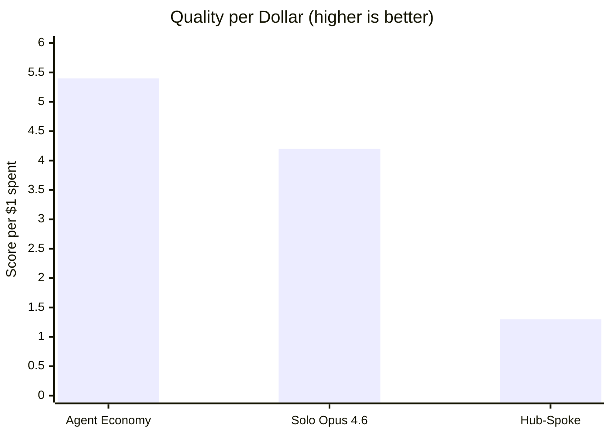
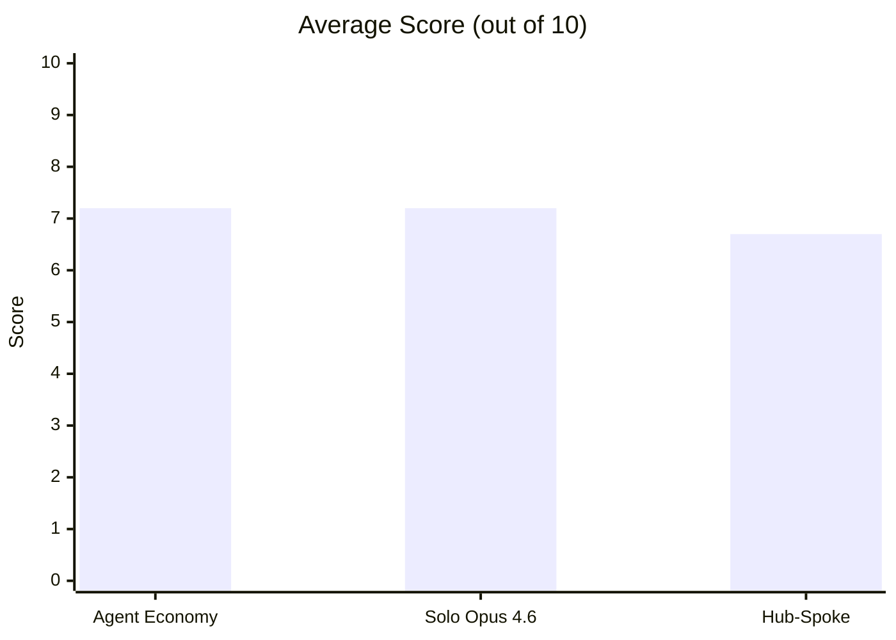
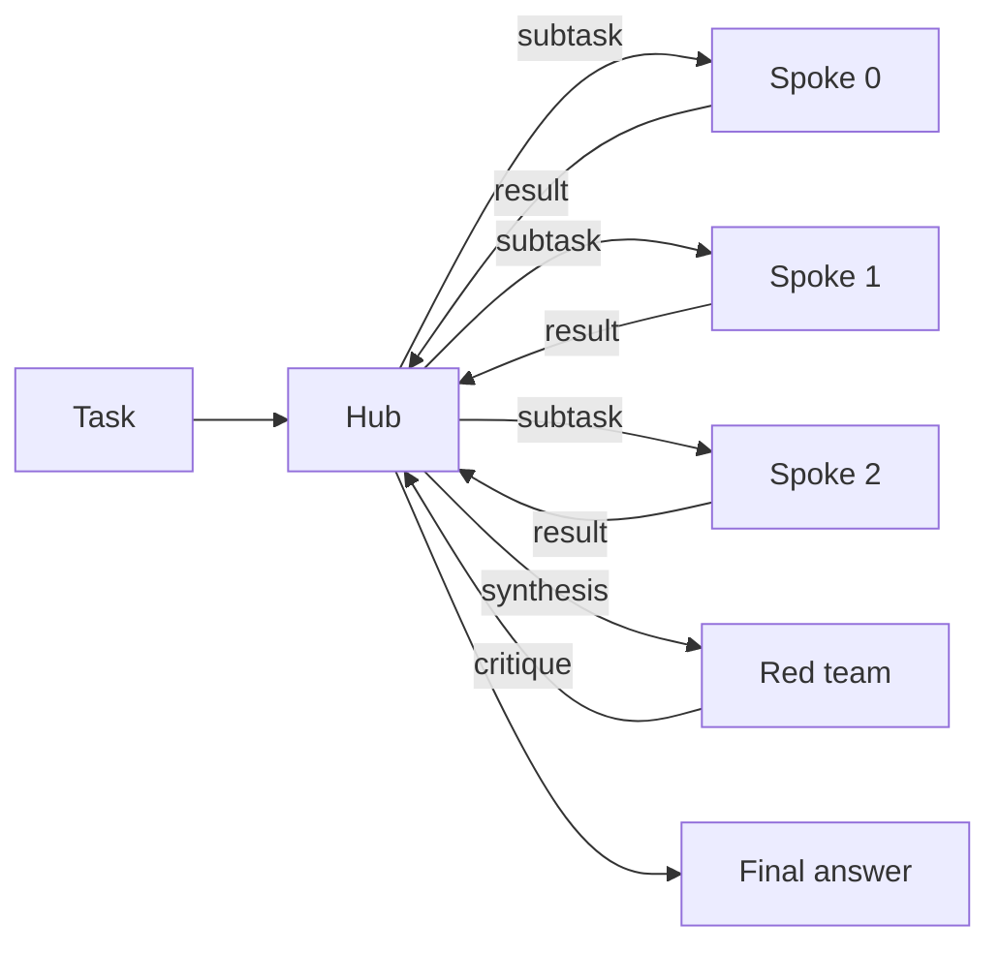
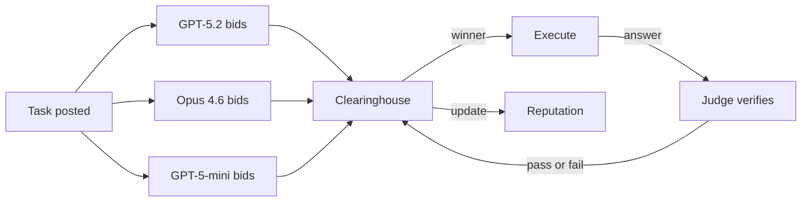

# Hub vs Spoke vs Market

This repo tests three ways to route LLM work.

One option is to send every task to one strong model. One option is to use a hub that splits the task into subtasks. One option is to let models bid, then route the task to the model the market chooses.

The benchmark runs all three on the same 15 tasks. It measures score, pass rate, cost, tokens, and time.

It does not show that auctions make models honest. It shows that model self-assessment can be useful when an allocator can observe outcomes and update future routing.

## Results

The tables below use the full run in `results/hard_run.jsonl` and `results/hard_summary.csv`.

### Full Run (15 Tasks, 3 Reps, 135 Scored Runs)





| Condition | Avg Score | Pass Rate | Total Cost | Score/$ |
| --- | ---: | ---: | ---: | ---: |
| Agent Economy | 7.2 | 76% (34/45) | $1.34 | 5.4 |
| Solo (Opus 4.6) | 7.2 | 73% (33/45) | $1.69 | 4.2 |
| Hub-Spoke | 6.7 | 67% (30/45) | $5.33 | 1.3 |

The market does not beat solo on quality. In this run though the market got similar quality for less money.

Bootstrap 95% confidence intervals overlap: market [6.1, 8.2], solo [6.3, 8.0], hub-spoke [5.8, 7.5].

## By Task Type

| Task type | Agent Economy | Solo (Opus 4.6) | Hub-Spoke |
| --- | ---: | ---: | ---: |
| Coding | 6.7 | 8.4 | 7.9 |
| Reasoning | 7.1 | 5.1 | 5.2 |
| Synthesis | 7.7 | 8.1 | 6.9 |

Solo was best on coding.

The market was best on reasoning.

Synthesis was close.

One reasoning task drives much of the gap. `reasoning-001` has one exact answer: `10/33`. The market got it in all three reps. Solo and hub-spoke missed it every time.

<details>
<summary>Full-run per-task scores (averaged over 3 reps)</summary>

| Task | Agent Economy | Hub-Spoke | Solo | Best |
| --- | ---: | ---: | ---: | --- |
| coding-001 (interval store) | 6.3 | 8.3 | 9.7 | solo |
| coding-002 (debug sliding window) | 10.0 | 9.7 | 9.3 | tie |
| coding-003 (refactor monolith) | 1.3 | 6.0 | 5.3 | hub-spoke |
| coding-004 (LRU cache) | 9.7 | 9.0 | 10.0 | tie |
| coding-005 (async concurrency bugs) | 6.0 | 6.7 | 7.7 | solo |
| reasoning-001 (combinatorial probability) | 10.0 | 0.0 | 0.0 | market |
| reasoning-002 (constraint scheduling) | 6.7 | 9.7 | 9.0 | hub-spoke |
| reasoning-003 (causal chain analysis) | 9.0 | 9.0 | 9.3 | tie |
| reasoning-004 (logic grid puzzle) | 3.0 | 4.0 | 3.3 | hub-spoke |
| reasoning-005 (constrained magic square) | 7.0 | 3.3 | 3.7 | market |
| synthesis-001 (distributed consistency) | 9.0 | 8.3 | 7.7 | market |
| synthesis-002 (monorepo debate) | 9.0 | 7.3 | 8.3 | market |
| synthesis-003 (multi-audience Raft) | 8.7 | 4.3 | 8.3 | tie |
| synthesis-004 (EHR architecture) | 6.0 | 6.0 | 7.0 | solo |
| synthesis-005 (microservices critique) | 6.0 | 8.3 | 9.0 | solo |

Task wins: Agent Economy 4, Solo 4, Hub-Spoke 3, with 4 ties.

`reasoning-001` asks for an exact-match probability answer. The only perfect answer is `10/33`. Only the market gets that answer in all three reps. `reasoning-004` stays hard for everyone; nobody averages above 4.

</details>

<details>
<summary>Hard vs medium tasks</summary>

| Difficulty | Agent Economy | Solo (Opus 4.6) | Hub-Spoke |
| --- | ---: | ---: | ---: |
| Medium (5 tasks) | 6.9 | 6.7 | 6.7 |
| Hard (10 tasks) | 7.3 | 7.4 | 6.6 |

Hard tasks did not break the market or solo. Hub-spoke dropped.

</details>

<details>
<summary>Market internals: routing and reputation</summary>

Three workers enter the market: GPT-5.2, Opus 4.6, and GPT-5-mini.

Who takes tasks? Across 45 full-run market tasks, GPT-5.2 takes 28, Opus 4.6 takes 11, six runs end with no fill, and GPT-5-mini takes none.

Reputation at session end: GPT-5.2 = 1.14, Opus 4.6 = 1.18, GPT-5-mini = 1.00.

Routing accuracy: on 15 shadow checks, the market matches the oracle winner 12 times. One miss comes from a wrong-model pick on the hard logic puzzle. Two misses come from no-fill runs even though a strong shadow answer exists.

</details>

<details>
<summary>Shadow counterfactual analysis</summary>

On 5 shadow tasks per rep, all three market workers answer the same question. That lets us compare the market winner with the best answer available in the pool.

Most checks show no regret. The clean routing miss lands on `reasoning-004` rep 0: the market picks Opus 4.6 and scores 3, while GPT-5.2 would have scored 9. The other misses land on `coding-005` rep 1 and `synthesis-005` rep 0, where the market fails to fill the task even though the shadow pool contains a 9-point answer.

Parallel-3-pick baseline: on 12 of 15 shadow runs, the market matches the result we would get by running all three answers and then taking the best one.

</details>

## What The Market Did

The market did not find a large set of specialists.

GPT-5.2 handled most tasks. Opus 4.6 handled some harder tasks. GPT-5-mini won none. Six market runs did not fill.

Most routing went to GPT-5.2 or Opus 4.6. The market did not use GPT-5-mini.

## Why Hub-Spoke Costs More

Hub-spoke has more steps.

The hub decomposes the task. Spokes answer subtasks. The hub synthesizes. A reviewer critiques. The hub revises.

That path spends tokens at every stage. It also adds places for drift and padding. Hub-spoke won a few tasks, but not enough to pay for the extra coordination.

## Follow-up: Fable 5 Self-Assessment (June 2026)

Claude Fable 5 shipped on June 9, 2026. We ran a calibration probe on the same 15 tasks. One fresh agent forecast its own pass probability for each task. A second fresh agent answered the task one-shot. The same GPT-5.2 judge graded the answers with the same rubrics and the same pass bar. Forecasts, answers, and grading scripts live in `results/fable_calibration_20260610/`.

| Metric | Fable 5 (solo, one-shot) |
| --- | ---: |
| Pass rate | 87% (13/15) |
| Mean stated p(success) | 0.85 |
| Brier score | 0.117 |
| Brier excluding one harness artifact | 0.060 |

For comparison: market 76%, solo Opus 4.6 73%, hub-spoke 67% on the original run. The six models in the [MarketBench](https://github.com/strangeloopcanon/agent-economy) phase-1 study scored Brier 0.156 to 0.216 on SWE-bench tasks.

Three things follow for this repo's question.

The market's key input got better. The original market ran on bids from models with weak calibration, so reputation and outcome history did most of the work. Fable's forecasts were spread (0.60 to 0.97), nearly unbiased (stated 0.85 vs realized 0.87), and its lowest forecasts landed on the genuine traps. Bids like that make allocation work closer to first principles.

The clearest case is `reasoning-004`. Every topology failed it in the original run. Fable's forecaster gave it 0.65 and named the exact reason: the puzzle admits two valid solutions and the judge holds one. The attempt then failed as predicted. A market with that signal can decline, reprice, or escalate instead of failing silently.

Solo got better too. One-shot Fable beat every topology on quality. A topology now has to win on cost, not quality. That sharpens the market's pitch rather than killing it: trustworthy self-reports are what let an allocator send easy tasks to cheap models and reserve the expensive one for tasks it flags as hard. Hub-spoke moves the other way. The better the single-context model, the more the decomposition overhead costs.

### The frontier CLI market (measured, one rep)

A follow-up run put frontier coding agents in the bidder pool: Opus 4.7-thinking via the Cursor CLI, GPT-5.5 via Codex, and GPT-5-mini, with `judge_include_self=False`. One rep over the same 15 tasks (`results/frontier_cli_market_20260610_corrected.jsonl`):

| Metric | Result |
| --- | ---: |
| Pass rate | 73% (11/15) |
| Avg score | 7.33 |
| Execution cost | $1.85 |
| Full session cost (incl. all bid calls) | $7.82 |

GPT-5.5 took 7 tasks, Opus 4.7 took 4, GPT-5-mini took 2, and two tasks (`coding-004`, `synthesis-004`) went unfilled and scored 0. The expensive pool did not pay for itself: quality landed at the original market's level for 4x the execution cost, and below solo Fable. Two of its four failures were allocation failures (no fill), not capability failures.

### Synthetic: Fable in the bidder pool

What if Fable had been a bidder? We can answer that by splicing measured results: each task goes either to a market (its real result from the runs above) or to Fable (its real one-shot result), depending on the routing rule. Two rules matter:

- **Route by Fable's bids**: Fable takes a task only when its own bid says it might fail (p < 0.85).
- **Route by track record**: Fable takes the tasks the market has failed before.

| Condition | Score | Pass | Cost/rep |
| --- | ---: | ---: | ---: |
| Cheap market alone | 7.2 | 76% | $0.45 |
| Frontier market alone | 7.3 | 73% | $1.85 |
| Solo Fable | 8.1 | 87% | $1.19 |
| Cheap market + Fable, routed by bids | 7.6 | 80% | $0.95 |
| Cheap market + Fable, routed by track record | **8.7** | **93%** | **$1.07** |
| Frontier market + Fable, routed by bids | 8.2 | 87% | $1.92 |
| Frontier market + Fable, routed by track record | 8.8 | 93% | $2.00 |

The pattern: routing by bids helps a little. Routing by track record wins big — on the cheap pool it beats solo Fable on quality *and* cost.

Why the gap? Fable's bids say where *Fable* struggles, but those tasks (the trap puzzles) are hard for everyone, so rerouting them buys little. Track record says where the *market* struggles — and those were tasks Fable bid 0.92+ on and aced. The two signals point at different tasks, and the second one is the one that pays.

The track-record rule does assume the allocator has seen these tasks fail before, which is what reputation systems accumulate over time. So the original conclusion of this repo stands, now with numbers behind it: self-assessment alone does not route well. Self-assessment plus observed outcomes routes better than anything we measured.

`results/fable_calibration_20260610/synthetic_market.py` builds all variants, including stricter bid thresholds and a no-fill backstop.

<details>
<summary>Per-task forecasts and outcomes</summary>

| Task | Fable p | Judge score | Pass |
| --- | ---: | ---: | ---: |
| coding-001 | 0.96 | 9 | yes |
| coding-002 | 0.97 | 10 | yes |
| coding-003 | 0.92 | 9 | yes |
| coding-004 | 0.97 | 10 | yes |
| coding-005 | 0.70 | 9 | yes |
| reasoning-001 | 0.96 | 0 | no (format artifact) |
| reasoning-002 | 0.96 | 10 | yes |
| reasoning-003 | 0.88 | 9 | yes |
| reasoning-004 | 0.65 | 3 | no |
| reasoning-005 | 0.60 | 8 | yes |
| synthesis-001 | 0.85 | 9 | yes |
| synthesis-002 | 0.85 | 9 | yes |
| synthesis-003 | 0.85 | 9 | yes |
| synthesis-004 | 0.78 | 9 | yes |
| synthesis-005 | 0.85 | 9 | yes |

The low forecasts cluster on the right tasks. `reasoning-005` (0.60) has a flawed premise; the answer passed by confronting it. `coding-005` (0.70) is the hardest coding task. `reasoning-004` (0.65) failed for the reason the forecast gave.

</details>

## How the Repo Runs the Test

Start at `scripts/run_benchmark.py`. The runner loads 15 tasks from `src/hub_vs_spoke/tasks/`, builds three configs, and loops over reps. Solo and hub-spoke run one task at a time. The market runs the full 15-task session in one clearinghouse so reputation can carry forward.

Each task ends the same way. The runner sends the answer to an evaluator. `reasoning-001` takes exact-match grading. The other 14 tasks go to `src/hub_vs_spoke/evaluation/judge.py`, which scores against a task rubric and marks a pass at score >= 7.

The repo stages every multi-agent flow in sequence. This benchmark measures coordination quality and cost. It does not measure parallel speed.

## The Three Topologies

### Solo

One Opus 4.6 agent gets the whole task. This gives us the control condition.

### Hub-Spoke

One Opus 4.5 hub reads the task, writes subtasks, hands them to three GPT-5.2 spokes, reads the outputs, writes a synthesis, asks the last spoke for a critique, and revises.



### Agent Economy

Three workers - GPT-5.2, Opus 4.6, and GPT-5-mini - bid on each task through [agent-economy](https://github.com/strangeloopcanon/agent-economy). The clearinghouse weights bid confidence by reputation, picks a winner, judges the answer, and may reopen the task after a failure. Reputation carries across the full 15-task session.



Each task is posted to the market. Workers bid. Reputation weights the bid. The judge checks the answer. The engine can reopen the task after a failed review.

There is also a legacy `spoke_spoke` peer-mesh topology in the codebase. The current benchmark does not use it. The tests keep it alive.

## Evaluation

Fourteen tasks use the LLM judge. One task - `reasoning-001` - uses exact match, with `10/33` as the only perfect answer. The rubric for each task rewards substance, punishes padding, and marks a pass at score >= 7.

The task set breaks down like this:

- Coding: interval store, sliding-window bug, refactor, LRU cache, async bugs.
- Reasoning: probability, scheduling, causal analysis, logic grid, magic square.
- Synthesis: distributed consistency, monorepo debate, multi-audience Raft, EHR architecture, microservices critique.

<details>
<summary>What a task looks like</summary>

`reasoning-005` asks for a constrained magic square:

> Place the digits 1 through 9 in a 3x3 grid so that each row, column, and both main diagonals sum to 15. The top-left cell must contain 2 and the center cell must contain 5. Provide the completed grid and prove it is the only solution satisfying all five constraints.

The rubric expects the unique solution `[[2,7,6],[9,5,1],[4,3,8]]`. A correct grid without the uniqueness proof caps in the middle. A wrong grid falls near the bottom.

</details>

## Caveats

1. GPT-5.2 both competes in the market and judges 14 of the 15 tasks. Style bias could lift market scores when GPT-5.2 wins.
2. GPT-5-mini never wins a task. The three-model market behaves more like a two-model market with a spectator.
3. `reasoning-001` drives a large share of the market's reasoning edge. Remove that task and the gap narrows.
4. The repo stages multi-agent flows in sequence. These numbers do not show wall-clock gains from true parallel work.
5. Bad self-assessment only becomes costly if future allocation, reputation, payment, or access changes.

## Setup

Python 3.11+ and [`uv`](https://docs.astral.sh/uv/) work well here.

```bash
git clone https://github.com/strangeloopcanon/hub-vs-spoke.git
cd hub-vs-spoke
uv pip install -e ".[dev]"

cp .env.example .env
# Fill in OPENAI_API_KEY and ANTHROPIC_API_KEY
```

## Run It

```bash
# Preview the matrix without calling any APIs
python scripts/run_benchmark.py --dry-run

# Full run (15 tasks x 3 topologies x 3 reps + shadow counterfactuals)
python scripts/run_benchmark.py --output results/hard_run.jsonl

# Analyse the JSONL into summary tables
python scripts/analyse_results.py results/hard_run.jsonl --csv results/hard_summary.csv

# Unit tests
python -m pytest tests/unit -v
```

<details>
<summary>CLI options</summary>

```bash
# One category
python scripts/run_benchmark.py --category coding

# One config
python scripts/run_benchmark.py --config agent-economy

# More reps
python scripts/run_benchmark.py --reps 5

# Tighter or looser budgets
python scripts/run_benchmark.py --budget-tokens 30000 --budget-turns 20
```

</details>

<details>
<summary>Project map</summary>

```text
src/hub_vs_spoke/
├── types.py                 Core data models and pricing tables
├── config.py                Settings via pydantic-settings (.env)
├── providers/
│   ├── base.py              LLMProvider protocol
│   ├── openai_provider.py   OpenAI chat completions
│   └── anthropic_provider.py Anthropic messages API
├── agents/
│   ├── agent.py             Agent wrapper with history and cost tracking
│   └── mock_agent.py        Deterministic mock for tests
├── topologies/
│   ├── base.py              Topology protocol
│   ├── _shared.py           Subtask parsing, retry logic, result building
│   ├── hub_spoke.py         Hub, spokes, red-team critique, revision
│   ├── solo.py              Single-model baseline
│   ├── market.py            agent-economy clearinghouse wrapper
│   └── spoke_spoke.py       Legacy peer mesh kept for tests
├── tasks/
│   ├── base.py              Task model and registry
│   ├── coding.py            5 coding tasks
│   ├── reasoning.py         5 reasoning tasks
│   └── synthesis.py         5 synthesis tasks
└── evaluation/
    ├── judge.py             LLM judge for rubric scoring
    ├── deterministic.py     Exact match, regex, and code checks
    ├── cost.py              Token-to-USD pricing
    └── reliability.py       Success and error helpers

scripts/
├── run_benchmark.py         Runs the benchmark matrix and emits JSONL
└── analyse_results.py       Builds summary tables and breakdowns

tests/
├── unit/                    Fast tests with no network
└── integration/             Full pipeline and live API tests
```

</details>

<details>
<summary>Adding tasks</summary>

Create a task in the relevant category file:

```python
Task(
    task_id="coding-006",
    category=TaskCategory.CODING,
    prompt="Your task description here.",
    eval_method=EvalMethod.LLM_JUDGE,
    eval_rubric="Specific scoring criteria.",
    difficulty="hard",
)
```

Append it to the category list and the registry picks it up on import.

</details>
